# Hardware/Software Co-Design for Canny Edge Detection Accelerator on Zynq-7000 SoC

A fully pipelined Canny Edge Detection IP core designed in Vivado HLS, integrated into a Zynq-7000 SoC system via AXI4-Stream/AXI DMA, with a Python-based verification framework using OpenCV as a golden-reference model.

## Author
- Dinh Xuan Kinh — Ho Chi Minh City University of Technology and Education (HCMUTE), Computer Engineering
  ([GitHub](https://github.com/113azprokinh-debug))

## Deliverables

| Deliverable                                  | Location                       |
| --------------------------------------------- | ------------------------------- |
| HLS implementation (hardware)                 | [hls/canny.cpp](hls/canny.cpp), [hls/tb_canny.cpp](hls/tb_canny.cpp) |
| Vivado block design (IP Integrator)            | [vivado/design_1.tcl](vivado/design_1.tcl) |
| Bare-metal firmware (Vitis/SDK)                | [sdk/main.c](sdk/main.c)        |
| Python verification framework (golden model)   | [python/edge-detection.ipynb](python/edge-detection.ipynb) |
| Sample input images                            | [data/input/](data/input)       |
| Reports (synthesis, timing, power, utilization)| [reports/](reports)             |
| Diagrams (block design, device package)        | [pictures/](pictures)           |

## Project Structure

```
canny-edge-zynq7000/
├── README.md
├── data/
│   └── input/                 # Sample test images (xray, pcb, crack) used for verification
├── hls/
│   ├── canny.cpp               # HLS hardware implementation: all 4 pipeline stages
│   └── tb_canny.cpp            # C-simulation testbench for the HLS core
├── vivado/
│   └── design_1.tcl            # Tcl script to regenerate the Vivado IP Integrator block design
├── sdk/
│   └── main.c                  # Bare-metal firmware (Vitis/SDK) running on the ARM Cortex-A9
├── python/
│   └── edge-detection.ipynb    # Golden-model verification notebook (OpenCV vs. simulated HW output)
├── pictures/                    # Block design / device package diagrams
└── reports/                     # Synthesis, timing, power, utilization, co-sim, and verification reports
```

## Index
- [Project Structure](#project-structure)
- [Setup](#setup)
- [Algorithm](#algorithm)
- [Hardware Architecture](#hardware-architecture)
  - [HLS Pipeline Stages](#hls-pipeline-stages)
  - [System Integration](#system-integration)
- [Implementation Results](#implementation-results)
  - [Resource Utilization](#resource-utilization)
  - [Timing Closure](#timing-closure)
  - [Power](#power)
- [Software Verification Framework](#software-verification-framework)
  - [Results](#results)
- [Limitations and Future Work](#limitations-and-future-work)

---

# Setup
- **HLS / Vivado:** open Vivado HLS with [hls/canny.cpp](hls/canny.cpp) and [hls/tb_canny.cpp](hls/tb_canny.cpp) for C-simulation, synthesis, and co-simulation. Use [vivado/design_1.tcl](vivado/design_1.tcl) to regenerate the block design in Vivado IP Integrator (`source design_1.tcl` in the Tcl console).
- **Bare-metal firmware:** import [sdk/main.c](sdk/main.c) into a Vitis/SDK application project targeting the exported hardware platform.
- **Python verification:** open [python/edge-detection.ipynb](python/edge-detection.ipynb) in Jupyter; it loads the sample images in [data/input/](data/input) and compares hardware-simulated output against the OpenCV golden model.

> **Note on hardware deployment:** this project reached full bitstream generation with positive timing closure (see [Implementation Results](#implementation-results)), but was not deployed on a physical board due to hardware availability constraints. All accuracy results were obtained through pre-silicon HW/SW co-simulation against a software golden model.

---

# Algorithm
The Canny edge detection algorithm implemented in this core follows four hardware stages (the classical 5-stage algorithm, with double-threshold and hysteresis merged into a single hardware stage for pipeline efficiency):

### 1. Grayscale conversion + Gaussian Blur
Converts the input frame to grayscale and applies a 3×3 Gaussian kernel to suppress noise before gradient computation.

$$G(x,y) = \frac{1}{2\pi\sigma^2} e^{-\frac{x^2+y^2}{2\sigma^2}}$$

$$I_{blur}(x,y) = \sum_{i=-1}^{1}\sum_{j=-1}^{1} G(i,j)\cdot I(x+i, y+j)$$

### 2. Sobel Gradient
Computes horizontal and vertical intensity gradients using the Sobel kernels:

$$G_x = \begin{bmatrix} -1 & 0 & 1 \\ -2 & 0 & 2 \\ -1 & 0 & 1 \end{bmatrix}, \quad G_y = \begin{bmatrix} -1 & -2 & -1 \\ 0 & 0 & 0 \\ 1 & 2 & 1 \end{bmatrix}$$

Gradient magnitude (approximated to avoid a hardware square-root):

$$|G| = \sqrt{G_x^2 + G_y^2} \approx |G_x| + |G_y|$$

Gradient direction, quantized into 4 angle bins (0°, 45°, 90°, 135°) to avoid an `arctan`/division in hardware:

$$\theta = \arctan\left(\frac{G_y}{G_x}\right)$$

### 3. Non-Maximum Suppression (NMS)
Thins detected edges down to single-pixel width by suppressing non-maximal gradient responses along the gradient direction:

$$
I_{nms}(x,y) =
\begin{cases}
|G(x,y)| & \text{if } |G(x,y)| \geq |G(\text{neighbor}_1)| \text{ and } |G(x,y)| \geq |G(\text{neighbor}_2)| \\
0 & \text{otherwise}
\end{cases}
$$

### 4. Double Threshold + Hysteresis
Classifies pixels as strong/weak/non-edge using two thresholds $T_{low}$, $T_{high}$:

$$
\text{pixel class} =
\begin{cases}
\text{Strong edge} & |G| \geq T_{high} \\
\text{Weak edge} & T_{low} \leq |G| < T_{high} \\
\text{Non-edge} & |G| < T_{low}
\end{cases}
$$

A weak edge is promoted to a real edge if it has at least one strong edge in its 8-neighborhood:

$$I_{out}(x,y) = 1 \iff \text{pixel is Strong, or (Weak} \wedge \exists \text{ neighbor Strong)}$$

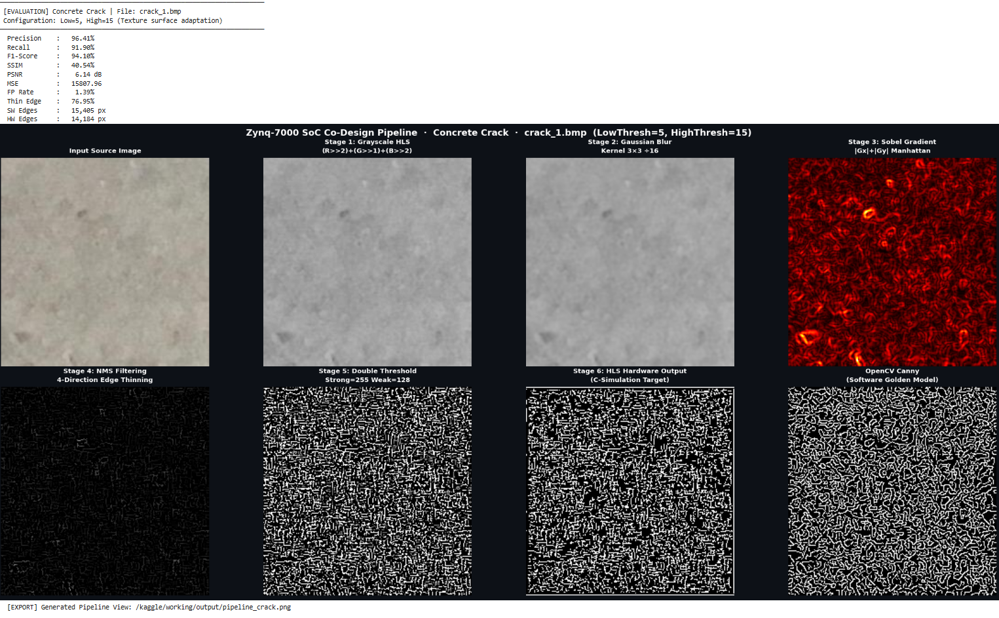
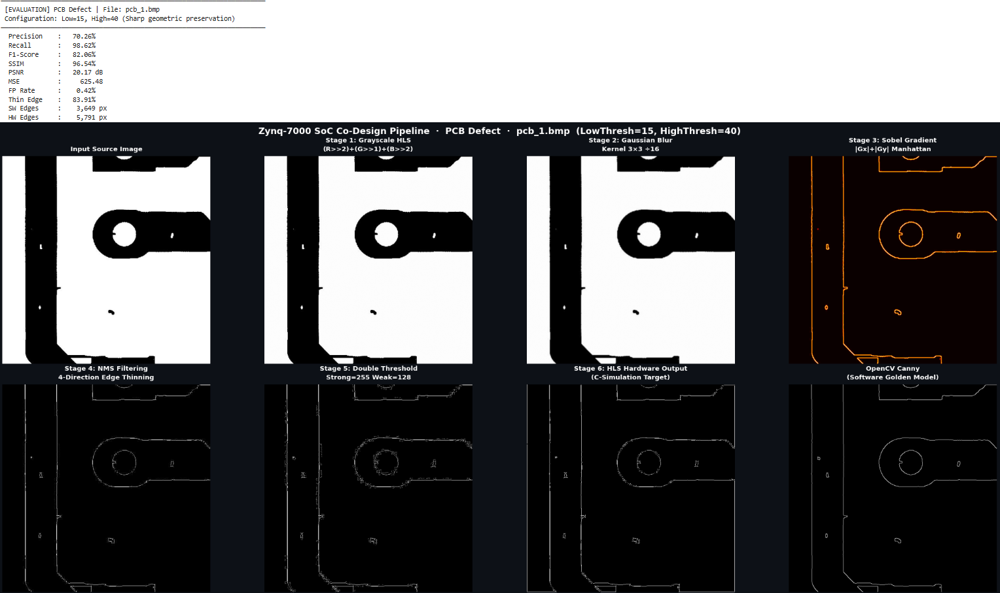
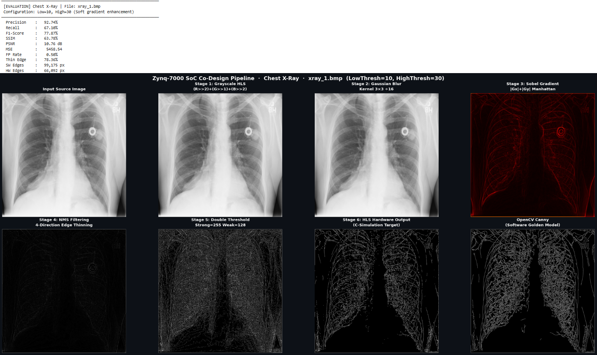

---

# Hardware Architecture

## HLS Pipeline Stages
Each stage is implemented as a separate HLS function connected by `hls::stream` FIFOs, with `#pragma HLS DATAFLOW` enabling all four stages to execute concurrently on consecutive frames. Each stage uses a 2-row line buffer and a 3×3 sliding window built directly from BRAM, avoiding floating-point and division operations entirely — all arithmetic is fixed-point/integer to meet the 10 ns clock target.

The core exposes:
- An **AXI4-Stream** slave/master pair (`stream_in`, `stream_out`) for pixel-level video transfer.
- An **AXI4-Lite** control bus (`s_axi_CTRL_BUS`) for runtime configuration of `rows`, `cols`, `low_thresh`, and `high_thresh` from the ARM Cortex-A9.

| Stage                  | Source file                  |
| ----------------------- | ----------------------------- |
| Gaussian Blur            | [hls/canny.cpp](hls/canny.cpp) |
| Sobel Gradient           | [hls/canny.cpp](hls/canny.cpp) |
| Non-Maximum Suppression  | [hls/canny.cpp](hls/canny.cpp) |
| Double Threshold + Hysteresis | [hls/canny.cpp](hls/canny.cpp) |
| Testbench                | [hls/tb_canny.cpp](hls/tb_canny.cpp) |

## System Integration
The HLS IP core (`canny_core_0`) is integrated into a Zynq-7000 SoC design in Vivado IP Integrator alongside:
- **AXI DMA** (`axi_dma_0`) — handles scatter-gather transfer of frame data between DDR memory and the core's AXI4-Stream ports.
- **ZYNQ7 Processing System** — ARM Cortex-A9 PS, providing the `M_AXI_GP0` master for AXI4-Lite control and `S_AXI_HP0` slave for high-performance DMA memory access.
- **AXI SmartConnect / AXI Interconnect** — routes control and data buses between PS and PL.
- **Processor System Reset** — generates synchronized reset signals across the design.

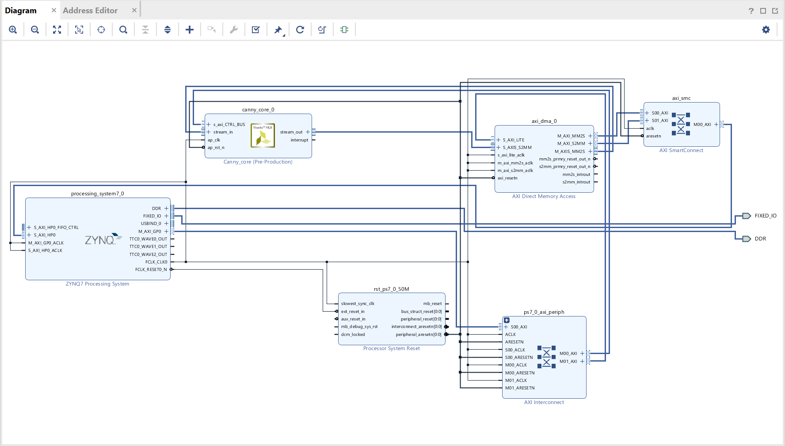
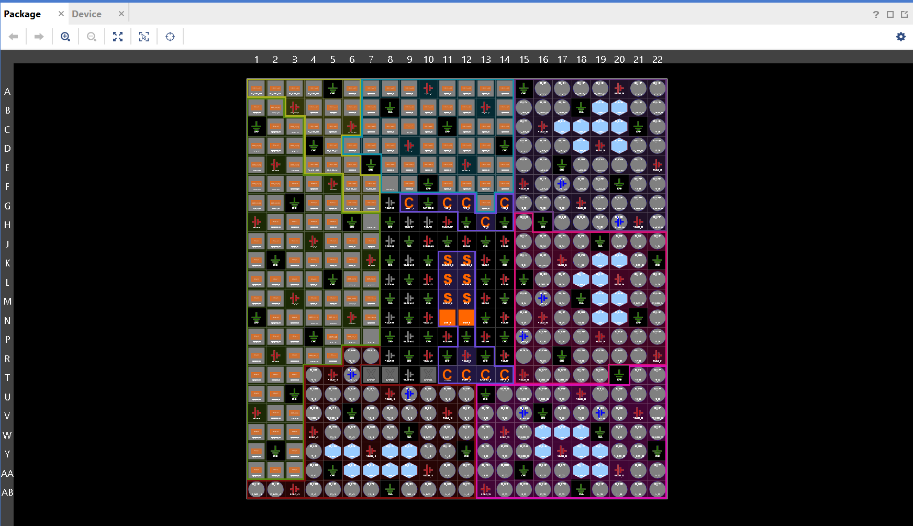

---

# Implementation Results

## Resource Utilization

HLS Synthesis estimate (target device `xc7z020clg484-1`):

| Resource | Used | Available | Utilization (%) |
| -------- | ---- | --------- | ---------------- |
| BRAM_18K | 19   | 280       | 6                 |
| DSP48E   | 16   | 220       | 7                 |
| FF       | 3653 | 106400    | 3                 |
| LUT      | 6740 | 53200     | 12                |

Post-Implementation (full SoC design, place & route):

| Resource        | Used | Available | Utilization (%) |
| ---------------- | ---- | --------- | ---------------- |
| Slice LUTs        | 7673 | 53200     | 14.4              |
| Block RAM Tile    | 10   | 140       | 7.1               |
| DSPs              | 16   | 220       | 7.3               |
| Slice Registers   | 8740 | 106400    | 8.2               |

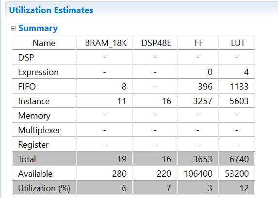
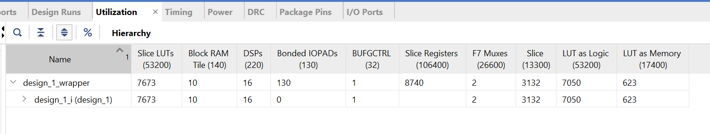
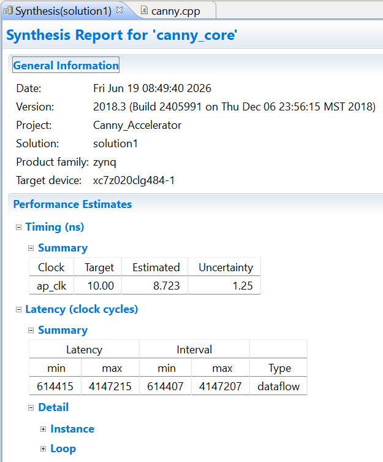

## Timing Closure
The implemented design closed timing with **positive slack** on the target clock:

| Metric                       | Value     |
| ----------------------------- | --------- |
| Worst Negative Slack (WNS)    | +0.067 ns |
| Worst Hold Slack (WHS)        | +0.017 ns |
| Total Negative Slack (TNS)    | 0.000 ns  |
| Worst Pulse Width Slack (WPWS)| 3.750 ns  |

Bitstream generation completed successfully.

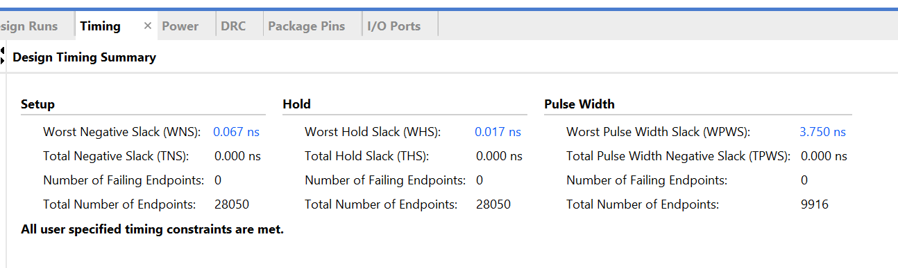
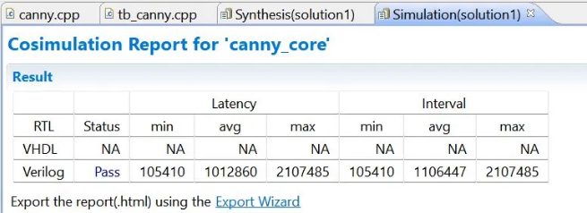

## Power
On-chip power estimate from the implemented netlist:

| Domain  | Power (W) | Share |
| -------- | --------- | ----- |
| PS7      | 1.533     | 94%   |
| Clocks   | 0.031     | 2%    |
| Signals  | 0.021     | 1%    |
| Logic    | 0.018     | 1%    |
| BRAM     | 0.011     | 1%    |
| DSP      | 0.009     | 1%    |
| **Total dynamic** | **1.624** | **92%** |
| Device static | 0.145 | 8% |
| **Total on-chip power** | **1.768 W** | |

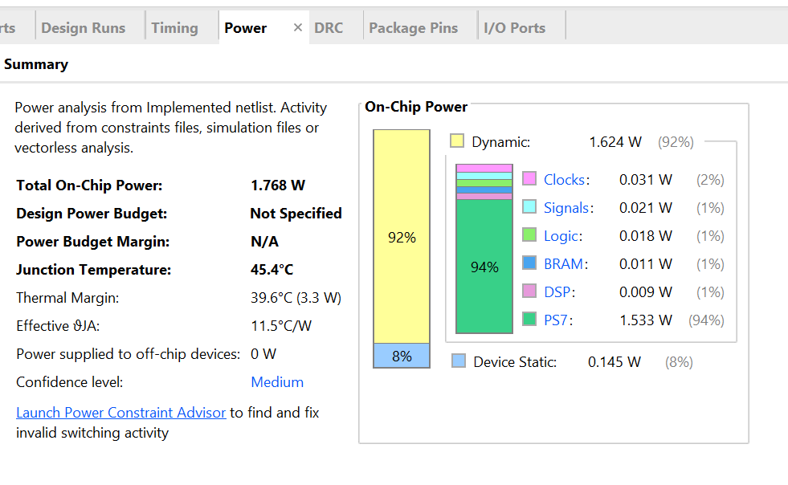

---

# Software Verification Framework
Since the design was not deployed on physical hardware, accuracy was validated through a Python-based HW/SW co-simulation framework using OpenCV's Canny implementation as a golden reference model. For each test image, the framework computes Precision, Recall, F1-Score, PSNR, MSE, and SSIM between the software golden output and the simulated hardware-accelerator output, and renders a pixel-level error map (white = match, red = miss, blue = false positive).

Source: [python/edge-detection.ipynb](python/edge-detection.ipynb)

## Results

Evaluated on three real-world datasets to test robustness across different edge characteristics:

| Dataset       | Precision | Recall | F1-Score | PSNR (dB) | MSE     | SSIM (%) | FP Rate |
| -------------- | --------- | ------ | -------- | --------- | ------- | -------- | ------- |
| Concrete Crack | 96.4%     | 91.9%  | 94.1%    | 6.14      | 15808.0 | 40.5%    | 1.4%    |
| Chest X-Ray    | 92.7%     | 67.1%  | 77.9%    | 10.76     | 5458.5  | 63.8%    | 0.5%    |
| PCB Defect     | 70.3%     | 98.6%  | 82.1%    | 20.17     | 625.5   | 96.5%    | 0.4%    |

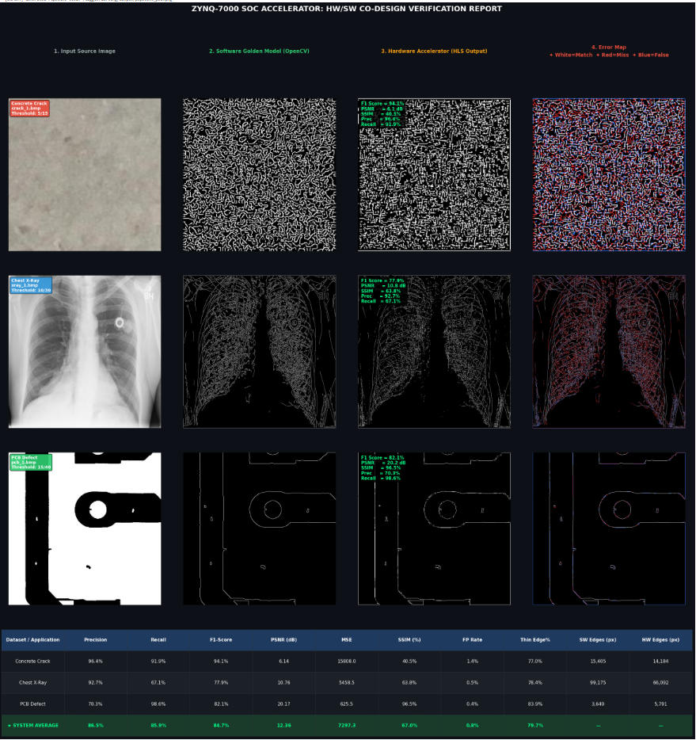

---

# Limitations and Future Work

- **No physical board deployment.** The bitstream was generated and timing-closed, but end-to-end validation on a Pynq/Zynq board with live video input was not performed due to hardware availability.
- **Fixed double-threshold.** Performance degrades on images with smooth gradients and low contrast (e.g. Chest X-Ray: Recall 67.1%), since a static threshold cannot adapt to local contrast the way adaptive or learning-based edge detectors can. A future iteration could explore adaptive thresholding based on local histogram statistics computed in the PS.
- **Single-resolution validation.** Resource and timing reports were generated for the synthesizable design; co-simulation was performed in software rather than on real-time video input through an HDMI/MIPI front-end.
